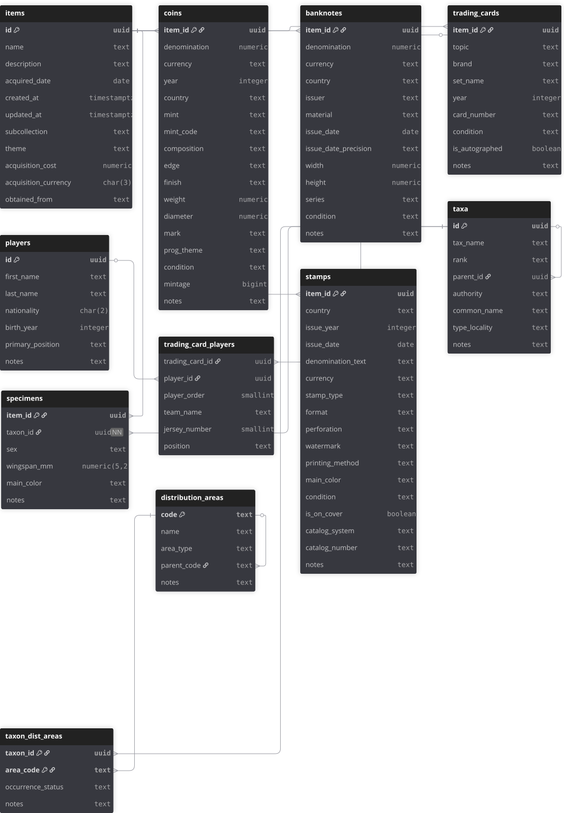

# SpecVault

<p align="center">

</p>

SpecVault is a cross-platform desktop application built with Flutter and Supabase.
It is a data-driven collection management system designed to catalogue, organize, and 
explore diverse physical items and subcollections such as numismatics, sports memorabilia, and scientific specimen.
It is intended to be a management system for a personal collection, 
covering diverse items and topics such as numismatics, sports memorabilia, and 
scientific memorabilia.

---

## Tech Stack

- **Frontend:** Flutter (desktop)
- **Backend:** Supabase (PostgreSQL)
- **Database:** PostgreSQL (SQL, migrations, constraints)
- **Other:** Python (data seeding utilities, planned)

---

## Database Design

SpecVault uses a normalized relational model centered around a generic `items` table.
Each subcollection maintains a 1-to-1 relationship with `items`.
Complex many-to-many relationships (e.g. trading cards ↔ players)
are handled via junction tables.

The current schema includes the following tables:

- `coins`
- `banknotes`
- `trading_cards`
- `players`
- `trading_card_players`


### Database Migrations and Schema

This project uses a migration-based approach to manage the database schema.

The database is hosted on Supabase (PostgreSQL), and schema evolution is managed using the Supabase CLI migration workflow.

Migrations are designed to be applied in order to reconstruct the database schema from a empty/clean state. 
During early development, migrations may be amended to fix mistakes and keep the migration chain consistent and replayable. 
As the project stabilizes, schema changes were introduced via new 
migrations rather than rewrites, keeping the evolution explicit and auditable.

- The `supabase/migrations/` directory contains the authoritative sequence of schema migrations applied to the database.
- Migrations are created locally using the Supabase CLI (`supabase migration new`) and applied to the remote database using `supabase db push`.
- Each migration file is timestamped by the CLI to guarantee deterministic ordering of schema changes.

During the early stages of development, schema modifications were executed directly in the Supabase SQL editor while the core database structure was being designed. Once the schema stabilized, the project transitioned to a CLI-managed migration workflow.

At that point, the current remote database structure was imported as a **baseline migration** using:
```
supabase db pull
```

Earlier exploratory migration scripts from the initial development phase are preserved in:

```
supabase/migrations_legacy/
```


- `supabase/schema.sql`  
  Canonical snapshot of the current database schema, derived from the applied migrations. Intended for documentation and reference rather than deployment.

- `supabase/dev_log.sql`  
  Development log / scratchpad containing exploratory queries, intermediate schema modifications, and testing statements executed during development. This file is **not idempotent** and is not intended to be executed end-to-end.

Together, these resources provide both:

- a **replayable migration history** for database deployment, and  
- a **transparent development record** of the database design process.


The relational structure of the SpecVault database is illustrated in the
diagram below (`docs/schema_diagram.svg`).



The diagram represents a simplified view of the database structure centered
around the `items` base table and its subcollection tables. It highlights the
main relationships between entities such as trading cards, players, and
biological taxonomy.

The diagram was generated using **DBML (Database Markup Language)**, through dbdiagram.io, 
and the source file is available at:

`docs/schema.dbml`

The authoritative database definition remains the SQL schema located in:

`supabase/schema.sql`


---

## Project Structure (so far)

```text
SpecVault/
├── supabase/
│   ├── migrations/        # Supabase CLI managed migrations
│   ├── migrations_legacy  # Earlier pre-CLI migrations
│   ├── schema.sql         # Canonical schema snapshot
│   ├── seed/              # Seed data (minimal, illustrative)
│   └── dev_log.sql        # SQL scratchpad / development notes
├── app/                   # Flutter application (in progress)
├── docs
    ├── SpecVault_logo_1
    ├── schema.dbml        # dbml file for dbdiagram.io
    └── schema_diagram.svg # database schema diagram image
├── README.md
└── LICENSE
```

[In Progress]
